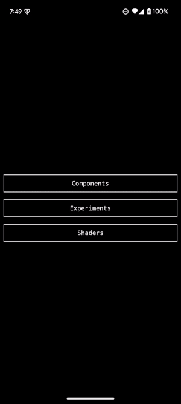
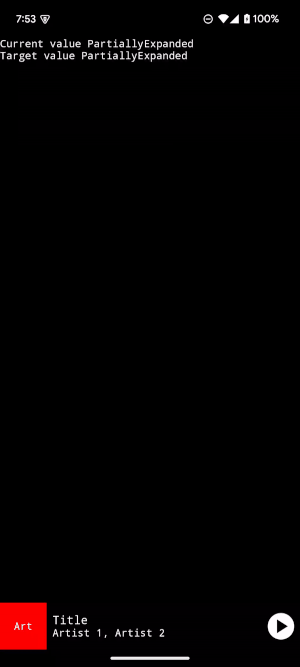

Palette is a [Compose Multiplatform](https://www.jetbrains.com/compose-multiplatform) theme library. It contains sets of UI components/modifiers/etc. and a catalog app to demonstrate them on Android, iOS, desktop, and web.

## Catalog App

[Source](app/src)

## Components

[Source](components/src)

### Media Control Sheet

Media Control Sheet is an interactive component that shows simple media information when collapsed and large-scale media artwork when expanded. It's inspired by similar components in the YouTube and YouTube Music apps.

### Media Control Bar

| 0% | 50%                                                                                                                                                                                                                                                   | 100% |
| -- |-------------------------------------------------------------------------------------------------------------------------------------------------------------------------------------------------------------------------------------------------------| ---- |
|  |  |  |

## Shaders

[Runtime Shaders](https://developer.android.com/reference/android/graphics/RuntimeShader) enable detailed control over how individual pixels are rendered on the screen. Below are shaders I've written, ported, or adapted as [Modifiers](https://developer.android.com/jetpack/compose/modifiers) that can be applied to any Composable that accepts a Modifier.

On Android, these shaders are powered by the RuntimeShader library and the [Android Graphics Shader Language (AGSL)](https://developer.android.com/develop/ui/views/graphics/agsl). On non-Android platforms, the shaders are powered by [Skiko](https://github.com/JetBrains/skiko) and the [Skia Shader Language (SkSL)](https://skia.org/docs/user/sksl/).

[Source](shaders/src)

### Color Split

Color Split allows individual color channels (e.g. red, green, blue) of the target to be shifted by variable amounts across the X and Y axes.

| [0.0, 0.0] | [0.1, 0.0] | [0.2, 0.0] | [0.0, 0.1] | [0.0, 0.2] | [0.2, 0.2] |
| ---------- | ---------- | ---------- | ---------- | ---------- | ---------- |
| ].png?raw=true>) | ].png?raw=true>) | ].png?raw=true>) | ].png?raw=true>) | ].png?raw=true>) | ].png?raw=true>) |
| ].png?raw=true>) | ].png?raw=true>) | ].png?raw=true>) | ].png?raw=true>) | ].png?raw=true>) | ].png?raw=true>) |

### Pixelate

The Pixelate shader assigns the color of all pixels in a region to that of a sample point within the region. Below is the effect with an increasing number of additional pixels in each region.

| 0 | 5 | 10 | 25 | 50 | 100 |
| - | - | -- | -- | -- | --- |
|  |  |  |  |  |  |
|  |  |  |  |  |  |

### Noise

A simple noise effect with increasing levels of opacity.

| 0% | 20% | 50% | 100% |
| -- | --- | --- | ---- |
| ].png?raw=true>) | ].png?raw=true>) | ].png?raw=true>) | ].png?raw=true>) |
| ].png?raw=true>) | ].png?raw=true>) | ].png?raw=true>) | ].png?raw=true>) |

## Screenshot Tests

With the exception of the GIFs, the images above were captured as gold files for automated screenshot tests of the library. Screenshots are generated for each Pull Request and compared against these gold files to ensure UI changes are made intentionally and with review. These screenshot tests are powered by [Paparazzi](https://github.com/cashapp/paparazzi) and [TestParameterInjector](https://github.com/google/TestParameterInjector).

[Component Tests](components/src/androidUnitTest/kotlin/com/alexrdclement/palette/components)

[Shader Tests](shaders/src/androidUnitTest/kotlin/com/alexrdclement/palette/shaders)
